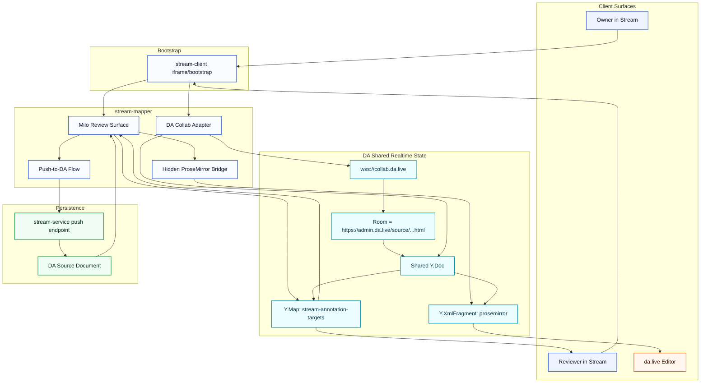
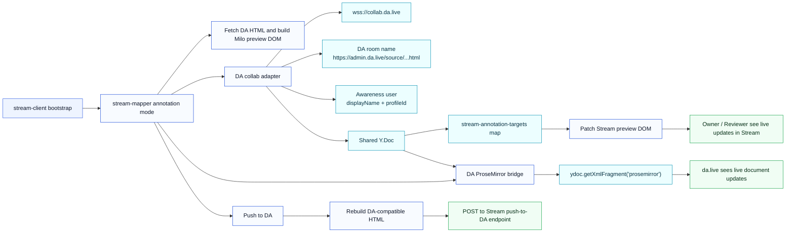
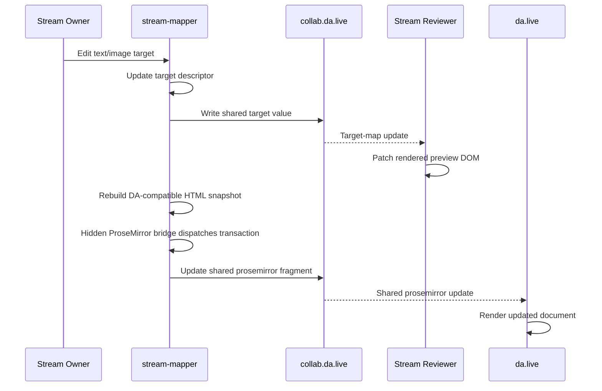
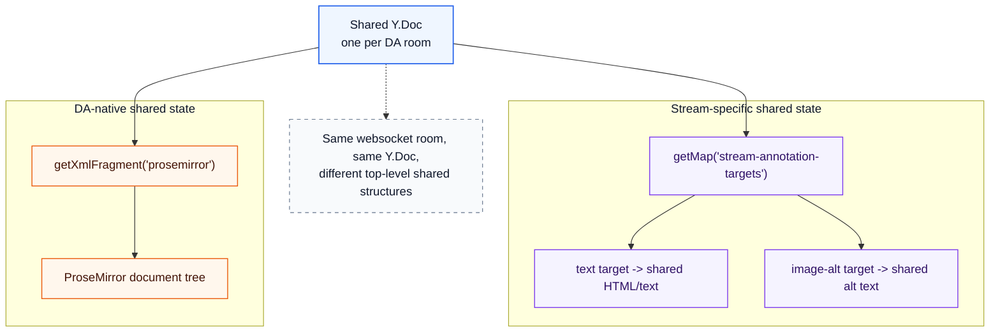

# Realtime Annotation Architecture

This branch keeps Stream as the review surface, uses the DA production collab room for shared presence and document state, and mirrors Stream edits into DA's live `prosemirror` fragment.

## What We Needed To Solve

We had three separate requirements at the same time:

- Stream owner and reviewer had to see each other's edits live inside the Stream preview.
- `da.live` had to receive those changes in the same shared document room.
- Stream still had to preserve its own Milo-based review surface and MediumEditor-like interaction model.

The hard part was that Stream edits happen on the rendered Milo DOM, while `da.live` edits the DA collab document through `Yjs + ProseMirror`.

## System View

## Final Working Flow

## Core Design

### 1. Stream remains the UX surface

Stream still renders the page by:

- fetching DA content,
- building a fresh `main`,
- running Milo decoration,
- enabling annotation selection and inline editing on the rendered DOM.

That means reviewers continue to look at the Stream preview, not a native `da.live` editor.

### 2. DA collab is the shared room and presence layer

The collab adapter now connects to:

- `wss://collab.da.live`
- with DA-style room names based on `https://admin.da.live/source/...`
- and awareness user data derived from `displayName + profileId`

This made the following work:

- owner and reviewer join the same DA room,
- usernames appear correctly instead of `Anonymous`,
- Stream sessions share a single collab transport.

### 3. Stream still keeps a target-level shared map for its own preview syncing

Inside Stream, we still maintain a shared Yjs map keyed by stable annotation target keys:

- text targets
- image alt targets

That map is useful because Stream edits are target-oriented and tied to the rendered Milo DOM, not directly to ProseMirror positions.

The shared target map is what keeps:

- reviewer preview updates live,
- comment-tab users in sync,
- target rebinding stable after DOM rebuilds.

### 4. DA live syncing now goes through ProseMirror, not direct HTML import into the live doc

This was the critical fix.

The earlier attempts failed because they wrote the wrong structural layer into the DA document:

- first we wrote a custom Yjs map, which `da.live` does not read
- then we tried to push reconstructed HTML straight through `aem2doc()` on the live doc
- that still did not match DA's real runtime editing model

The working version adds a hidden ProseMirror bridge:

- it uses the same vendored DA wrapper runtime as the collab doc
- it binds to `ydoc.getXmlFragment('prosemirror')`
- it converts the rebuilt DA-compatible HTML into a ProseMirror document
- it dispatches a real ProseMirror transaction into the shared fragment

That makes Stream behave much closer to how `da.live` itself updates the room document.

## Why The Runtime Alignment Mattered

One subtle bug was that the collab socket and the ProseMirror bridge were initially using different Yjs runtimes:

- collab adapter from `esm.sh`
- ProseMirror bridge from DA's vendored wrapper

That can break constructor identity and shared fragment behavior.

The final working version aligns both on the same DA vendored wrapper runtime, so:

- `Y.Doc`
- `WebsocketProvider`
- `ySyncPlugin`
- `prosemirror` fragment access

all come from the same stack.

## Sequence Of Events During An Edit

## Shared Document Shape

## Main Files

### `stream-client`

- passes the bootstrap values Stream needs for DA collab:
  - token
  - `profileId`
  - `displayName`
  - `collabId`
  - `contentUrl`
  - `targetUrl`
  - realtime feature flag

### `stream-mapper`

- `streamlibs/operations/annotation/da-collab.js`
  - builds DA room names
  - connects to `wss://collab.da.live`
  - sets awareness user payload
  - uses the DA vendored Yjs wrapper runtime

- `streamlibs/operations/annotation/inline-editing.js`
  - manages inline editing
  - keeps Stream target-level shared state
  - mirrors rebuilt DA-compatible content into the ProseMirror bridge

- `streamlibs/operations/annotation/da-prosemirror.js`
  - loads DA parser + DA wrapper
  - creates the hidden ProseMirror bridge
  - binds to `ydoc.getXmlFragment('prosemirror')`

- `streamlibs/operations/annotation.js`
  - initializes annotation preview
  - keeps push-to-DA behavior

- `streamlibs/target/da.js`
  - converts Stream HTML into DA-compatible HTML/document format

## Current Tradeoff

This branch now supports:

- Stream owner/reviewer live sync
- correct user presence
- live updates reaching `da.live`

But the architecture is still hybrid:

- Stream editing starts from target-level annotation semantics
- DA live syncing happens through a hidden ProseMirror bridge

So the source of user interaction is still Stream, while the source of DA document truth is the shared `prosemirror` fragment.

## Future Cleanup Path

If we want to simplify this further later, the cleanest next step would be:

- make the ProseMirror fragment the single editing source earlier in the pipeline
- reduce reliance on the custom target map for text targets
- keep the Stream preview as a projection of the shared document model

That would reduce duplication between:

- Stream target-state syncing
- DA document syncing

but the current branch is a pragmatic middle ground that preserves the Stream UX while making DA live sync work.
